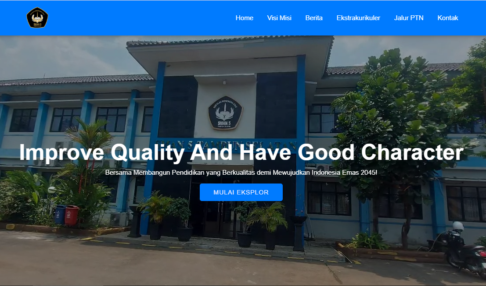
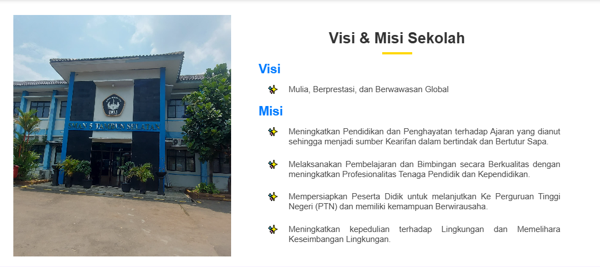
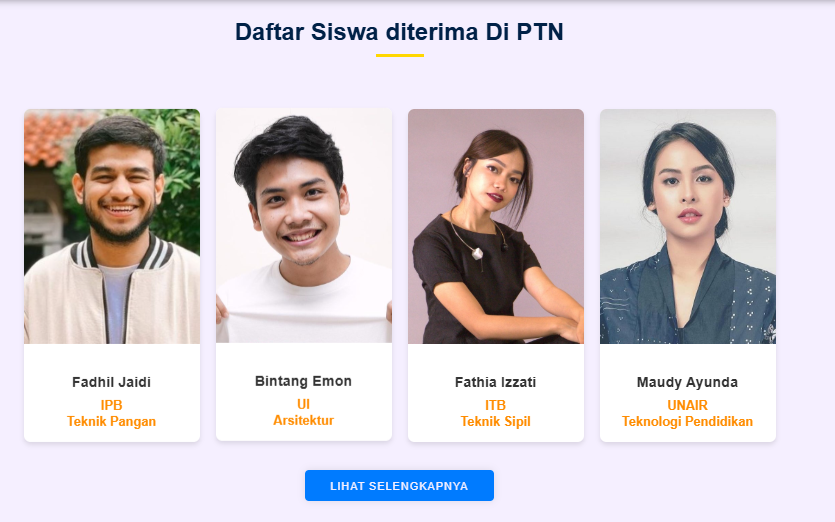
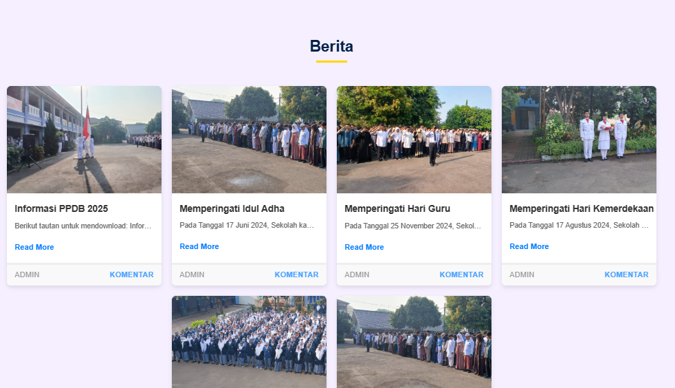
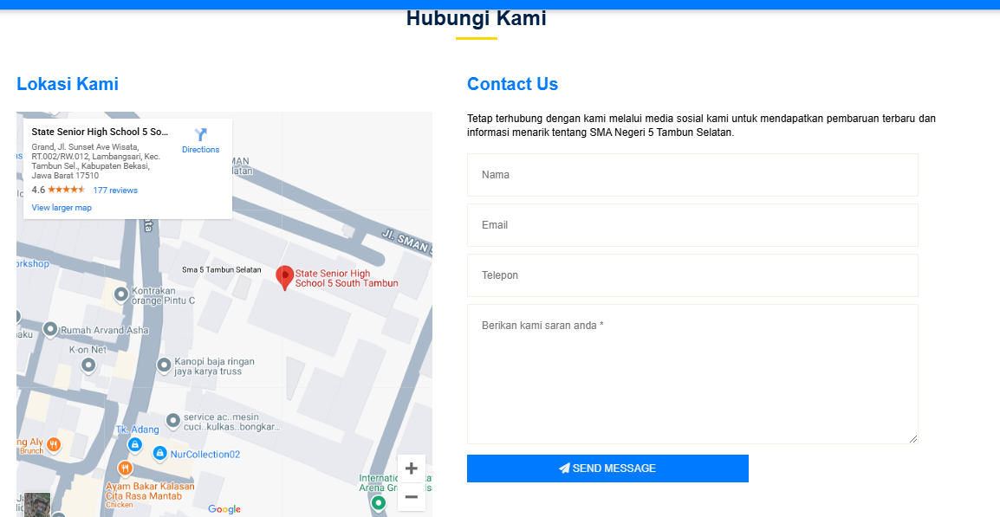

# Tema Kelompok Disini

## Pengenalan Project

Website Sekolah menjadi garda terdepan dalam memberikan informasi sekolah kepada masyarakat. Website dapat berguna untuk promosi secara efektif dan efisien. Dan dengan adanya website, sekolah dapat memberikan informasi lebih transparan dan terbuka kepada masyarakat.

## Nama Kelompok

<table border="1">
  <thead>
    <tr>
      <td>No</td>
      <td>NIM</td>
      <td>Nama Anggota</td>
    </tr>
  <thead>
  <tbody>
    <tr>
      <td>1</td>
      <td>19235069</td>
      <td>Yoga Arbi Fatoni</td>
    </tr>
    <tr>
      <td>2</td>
      <td>19235186</td>
      <td>Fajar Sianipar</td>
    </tr>
    <tr>
      <td>3</td>
      <td>19235146</td>
      <td>Adhitya Febbyan Widianto</td>
    </tr>
  </tbody>
</table>

## Skenario Kebutuhan Pengguna

<strong>Pengguna</strong>

<ol>
<li>Melihat Visi Misi Sekolah</li>
<li>Melihat Siswa/I yang diterima di PTN</li>
<li>Mengetahui berbagai ekstrakurikuler di Sekolah</li>
<li>Melihat Berita atau Informasi Terbaru</li>
<li>Mengetahui letak Lokasi Sekolah</li>
<li>Memberi kritik atau saran kepada pihak Sekolah</li>
</ol>

<!-- Sesuaikan dengan hak akses dari project masing-masing kelompok -->

## Screenshot

<table width="100%">
<tr>
<td><h3 align="center">Menu 1</h3></td>
<td><h3 align="center">Menu 2</h3></td>
</tr>
<tr>
<td><h3 align="center">Menu 3</h3></td>
<td><h3 align="center">Menu 4</h3></td>
</tr>
<tr>
<td><h3 align="center">Menu 5</h3></td>
</tr>
</table>

## Lisensi

Project ini dibuat untuk menyelesaikan project mata kuliah Web Programming II Universitas Bina Sarana Informatika (UBSI) yang diampu oleh Bpk. <a href="https://github.com/yuris60">Yuris Alkhalifi, M.Kom., CPDSA</a> selaku Dosen. Project ini bersifat open source untuk edukasi.

<!-- Kalian boleh mengubah bentuk lisensi ini sesuai kesepakatan kelompok apakah akan bersifat open source atau tidak -->
<blockquote>Kuliah...? BSI AJA !!</blockquote>
